<p align="center">
  
</p>

<p align="center">
  
  
  
  
  
  
</p>

<p align="center">
  <a href="https://github.com/Vinicius-Duran"></a>
  <a href="https://www.linkedin.com/in/vinicius-duran"></a>
  <a href="https://wa.me/5548992110831"></a>
</p>

Portfólio pessoal de Vinicius Duran, desenvolvedor full-stack em Florianópolis/SC.
Construído em React 19 com Vite, design system em CSS custom properties e motion
com GSAP e anime.js.

Direção visual: fundo carvão quente, um único acento âmbar e Archivo — grotesk
técnica — pesada no display contra o mesmo desenho em peso de texto. Sem
gradiente de marca e sem serif. As imagens deste README saem das mesmas
variáveis do site, e animam pela mesma gramática.

## Paleta

| | token | valor | onde |
|---|---|---|---|
|  | `--ink-000` | `#14100c` | o piso, carvão quente, nunca preto |
|  | `--ink-100` | `#221c18` | planos elevados, cartas, cabeçalho |
|  | `--paper` | `#efe8dc` | tinta off-white quente, e seus alfas |
|  | `--amber` | `#d9743f` | o acento. Um só, no site inteiro |

## Stack

- React 19 · React Router DOM 7
- Vite 6
- CSS custom properties (sem framework de estilo)
- GSAP (ScrollTrigger, SplitText, ScrambleText) · anime.js 4
- Vitest · ESLint 9

## Motion

<p align="center">
  
</p>

A rolagem não revela conteúdo, ela conduz. São três movimentos:

**A montagem.** Cada bloco é uma peça: um quadro de wireframe é desenhado, ganha
o rótulo do que ele é (`h1 · hero`, `section · intro`), o conteúdo entra por
dentro dele, e a guia se retira. O herói roda a sequência inteira no
carregamento, com o título escrito caractere a caractere como saída de
compilador; as outras seções repetem a mesma gramática, mais rápida, ao entrar
na tela. Um leitor de build fixo acompanha qual "arquivo" está montado.

**Os trilhos horizontais.** O manifesto e a galeria de trabalho prendem a seção
na tela e convertem rolagem vertical em deslocamento horizontal. Os elementos
dentro do trilho têm gatilhos próprios via `containerAnimation` — sem isso um
ScrollTrigger de filho mede a posição vertical e nunca dispara. A distância é
recalculada a cada refresh, porque depende de larguras que mudam quando a fonte
carrega.

**O baralho.** As quatro etapas do processo param no topo e se empilham. A carta
que sai recua por escurecimento e desfoque, nunca por opacidade: translúcida,
ela deixaria a de trás atravessá-la e as duas leriam sobrepostas.

Toda a animação sai de `src/lib/motion.js` — `assemblePart`, `buildIntro`,
`buildOnScroll`, `horizontalTrack`, `enterFromTrack`, `stackCards` — mais o
stagger das listas (anime.js) e o embaralhamento de texto nos projetos. O
pin só existe acima de 900px, por `gsap.matchMedia`: no toque os mesmos blocos
viram pilha e rolagem horizontal nativa.

Duas regras sustentam esse módulo:

- **Nenhum estado inicial de animação mora no CSS.** Quem esconde para revelar é
  o JS, em `useLayoutEffect`. Um `opacity: 0` escrito na folha de estilo apaga a
  seção de vez quando o observador não dispara — já aconteceu neste repositório.
- **Só `transform`, `opacity`, `filter`, `clip-path` e `mask` animam.** Animar
  `padding` ou `width` recalcula layout a cada frame.

`prefers-reduced-motion` é respeitado no ponto de entrada de cada animação: sob
essa preferência elas não são criadas, e o conteúdo simplesmente aparece.

## Rodando

```bash
npm install
npm run dev      # ambiente de desenvolvimento
npm run build    # build de produção em dist/
npm run preview  # pré-visualiza o build
npm run lint     # análise estática
npm test         # suíte de testes
```

## Deploy

Vercel, a partir de `main`. O build sai em `dist/`.

`vercel.json` existe por um motivo específico: o roteamento é do cliente, e o
build gera um `index.html` só. Sem a regra de rewrite, `/about`, `/ia` e
`/projects/:slug` respondem 404 do servidor em acesso direto, refresh ou link
compartilhado — o visitante nem chega na página 404 do site. A regra manda
todo caminho para o `index.html` e deixa o React Router resolver; arquivos que
existem no disco continuam sendo servidos antes dela.

## Estrutura

```
src/
  components/    Header, Grain, Marquee, ScrollProgress, Manifesto,
                 AiSection, HeroBackdrop, BuildHud, Frame
  data/          conteúdo do site — perfil, projetos, certificados,
                 competências, engenharia de IA
  lib/           motion.js — registro do GSAP e as gramáticas de animação
  pages/         home, about, ai, project, notfound
```

O fundo do herói é montado com as capturas reais dos projetos, em duotone
âmbar e bem apagadas. Não há banco de imagens no site: "código na tela" é o
clichê número um do portfólio de desenvolvedor e diria o contrário do que a
página afirma.

## Camada de dados

Todo o conteúdo vive em `src/data/`, separado da apresentação. Atualizar o site é
editar esses arquivos, não os componentes.

| Arquivo | Conteúdo |
|---|---|
| `profile.js` | identidade e canais de contato — fonte única |
| `projects.js` | nove projetos: seis em destaque, com case study completo (desafio, solução, resultado), e três secundários, listados só como link de repositório |
| `certificates.js` | 19 certificados e seus PDFs em `public/` |
| `skills.js` | competências por grupo |
| `ai.js` | engenharia de IA, na home e em `/ia` — a arquitetura em alto nível (papéis, regras, lições), nunca nome de agente, de ferramenta, de arquivo ou de projeto |

Uma rota de case study (`/projects/:slug`) só existe para os projetos em destaque;
acessar o slug de um projeto secundário redireciona de volta para a seção de
projetos da home.

`/ia` é a página de engenharia de IA: o pipeline de agentes percorrido pela
rolagem — preso na tela acima de 900px, empilhado abaixo disso e sob movimento
reduzido —, as regras do sistema, a pessoa no circuito e as lições.

## Testes

A suíte não testa aparência: ela protege a integridade do conteúdo. Verifica que
nenhum projeto fictício volte ao site, que nenhum texto de rascunho vaze para a
interface, que os dados de contato venham de `profile.js`, que todo PDF de
certificado referenciado exista no repositório, e que a engenharia de IA não
cite nome de agente, de modelo, de ferramenta, de arquivo ou de projeto.

```bash
npm test
```
